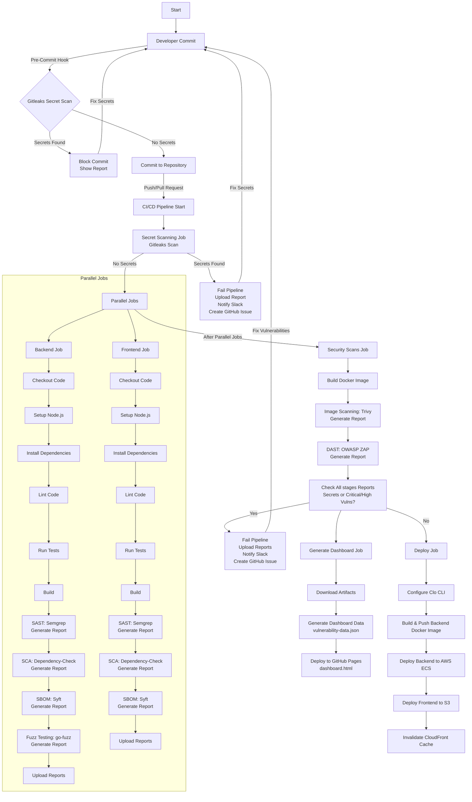

    name : CI/CD with Comprehensive Security

    on:
        push:
            branches:
                - main
        pull-request:
            branches:
                - main
    
    jobs:
        secret-scanning:
            runs-on: ubuntu-latest
            steps:
                - name: checkout Code
                  run: git clone https://github.com/${{github.repository}} .

                - name: Install Gitleaks
                  run: |
                    curl -sSfL https://github.com/gitleaks/releases/download/v8.18.4/gitleaks_8.18.4_linux_x64.tar.gz | tar -xz 
                    mv gitleaks /usr/local/bin/

                - name: Scan for secrets
                  run: gitleaks detect --source . --config .gitleaks.toml --report-format json --report-path secret-report.json

                - name: Check for secrets
                  run: |
                  if [ -s secret-report.json ] && [ "$(jq '. | length' secret-report.json)" -gt 0]; then
                    echo "Secrets found in code. Aborting pipeline."
                    cat secret-report.json
                    exit 1
                  fi
                  
                - name: Scan for secrets
                  run: gitleaks detect --source . --config .gitleaks.toml --report-format json --report-path secret-report.json


```